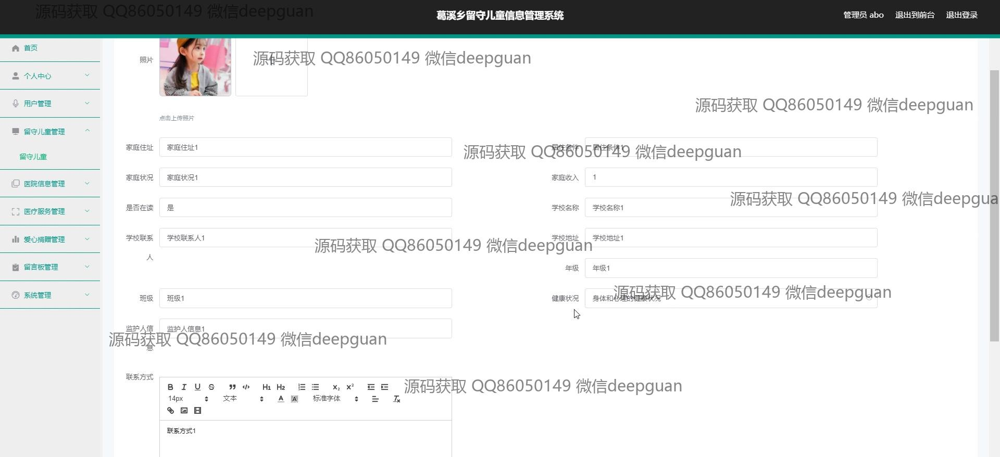
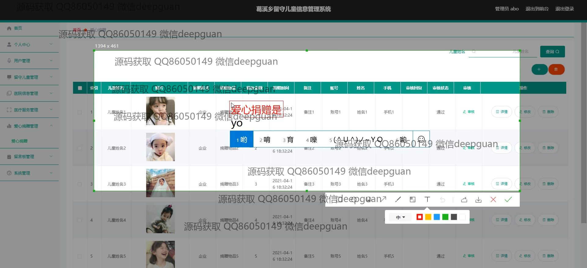
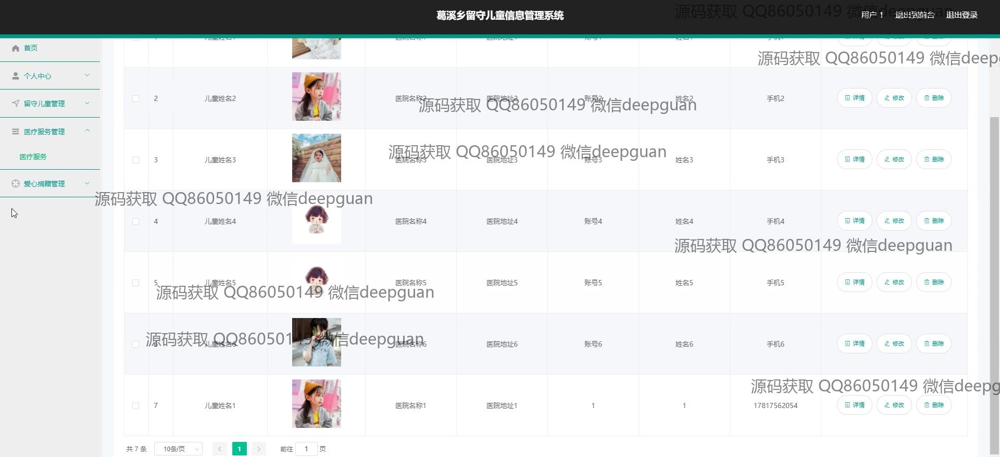

<h1 align="center">葛溪乡留守儿童信息管理系统+vue</h1>

## 简介
葛溪乡留守儿童信息管理系统：角色分为管理员、用户；提供用户管理、儿童信息管理、医疗服务管理、爱心捐赠管理、公告资讯、留言反馈等功能。    --计算机毕业设计源码；毕设源码；java毕业设计源码

## 联系方式

<h3 align="center">获取完整代码与数据库文件 + 微信：deepguan QQ: 86050149 QQ群: 783742310</h3>

<h3 align="center">可帮忙远程部署 包运行成功！提供远程部署、修改代码、设计文档指导、代码讲解等服务！</h3>

## 功能介绍（完整见运行截图）
管理员：  
基本功能：登录、注册、退出系统，支持账号信息的查看与修改。  
系统管理：包括用户管理、留守儿童管理、医疗信息管理、公告资讯管理、留言管理和爱心捐赠管理等功能模块，能够实现数据的新增、修改、删除和搜索操作。  
信息管理：支持留守儿童信息的批量录入、编辑及审核，涵盖儿童姓名、性别、年龄、住址、家庭收入、健康状况等详细信息。  
统计与操作：通过留言板模块处理用户留言，提供快速回复和删除功能，捐赠信息管理模块支持查看捐赠记录并进行审核操作。  

用户：  
基本功能：登录、注册、退出系统，查看和修改个人信息。  
信息浏览：能够浏览公告资讯、医疗服务信息和捐赠信息，支持通过搜索功能快速查找相关内容。  
操作模块：在爱心捐赠模块提交捐赠记录，包括捐赠形式、金额和时间等信息，并在留言模块提交反馈或建议。  
个人中心：查看与修改个人账户信息，查看系统公告及相关资讯，提高对系统功能的利用效率。

## 运行截图

本代码来源于网络,仅供学习参考使用!

